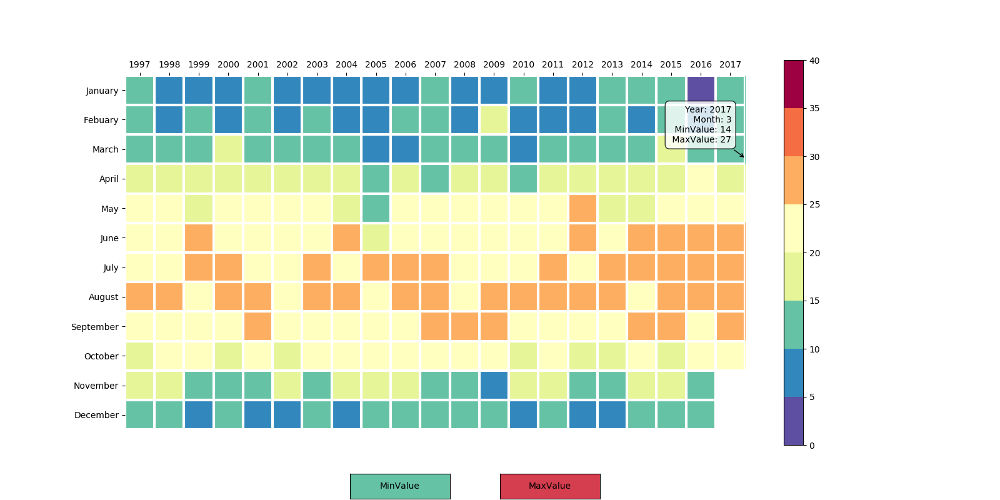
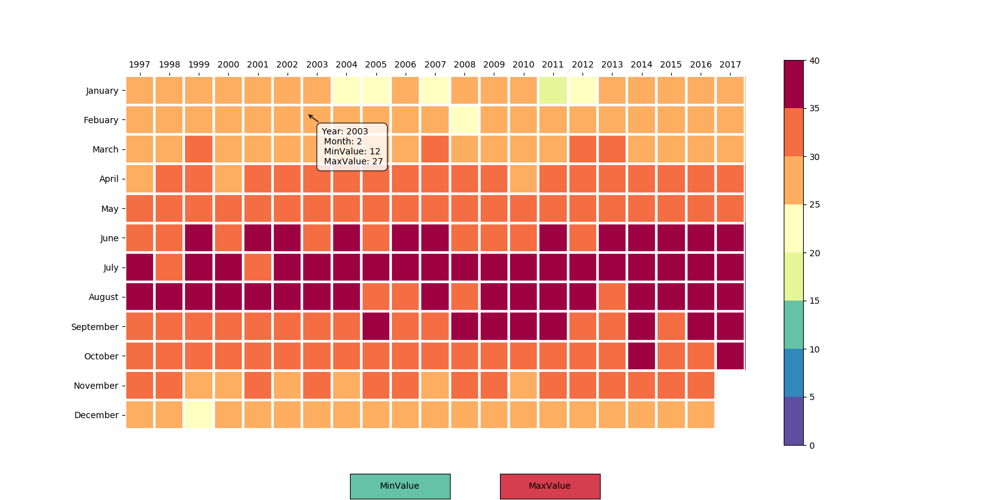

# Challenge1

HK Temperature Heatmap by Year and Month

To show the minimum and maximum temperature values among each month from 1997-2017

Use Pandas library to conduct data processing and data visualization

Import [mplcursors](https://mplcursors.readthedocs.io/en/stable/) library to implement the hover effect

## Minimum monthly temperature heatmap

## Maximum monthly temperature heatmap

## Contact Me
If you've encounted any problems, please do not hesitate to send an email to [Chloe Dong (me)](https://github.com/yifeidongchloe) at yifei2959@gmail.com or opening an issue on github.
