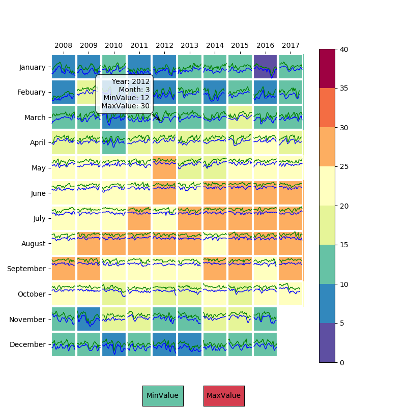
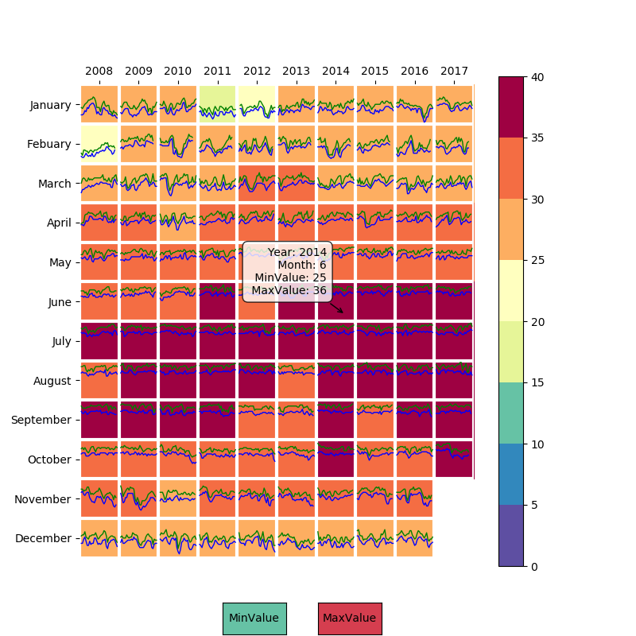

# Challenge2

HK Temperature Heatmap by Year and Month and line charts of showing the tendency of daily temperature in each month

To show the daily temperature among each month from 2008-2017

Use Pandas library to conduct data processing and data visualization

Import [mplcursors](https://mplcursors.readthedocs.io/en/stable/) library to implement the hover effect

## Minimum monthly temperature heatmap and daily temperature linecharts

## Maximum monthly temperature heatmap and daily temperature linecharts

## Contact Me
If you've encounted any problems, please do not hesitate to send an email to [Chloe Dong (me)](https://github.com/yifeidongchloe) at yifei2959@gmail.com or opening an issue on github.
