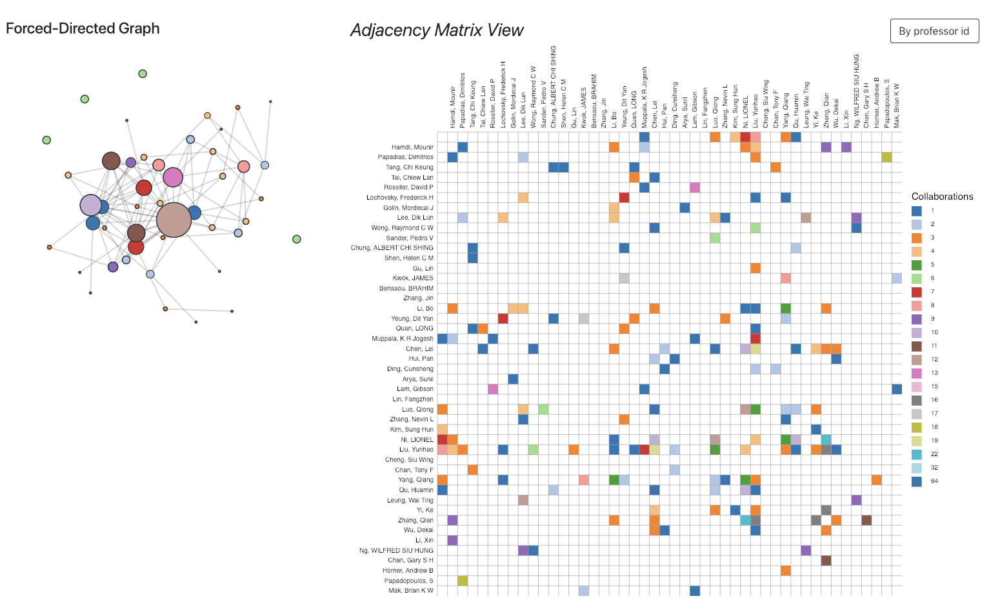
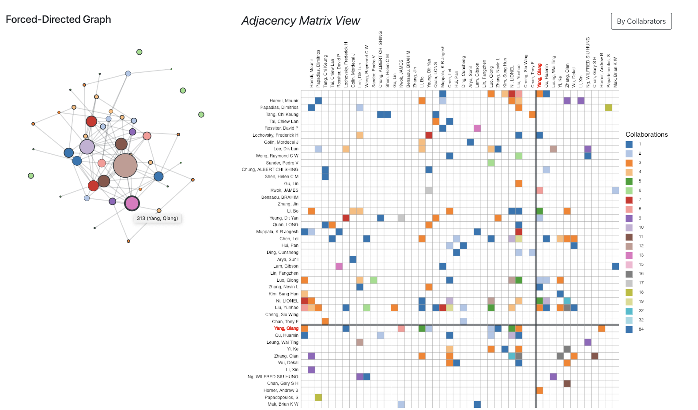
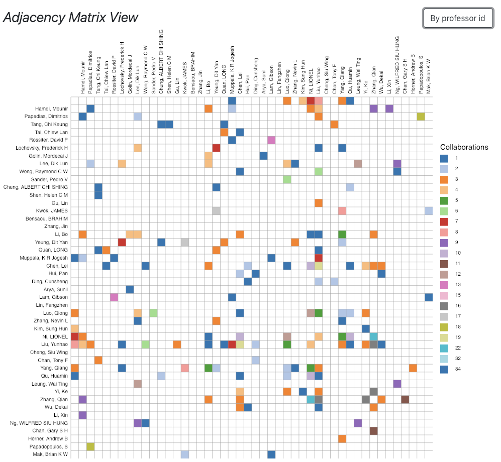
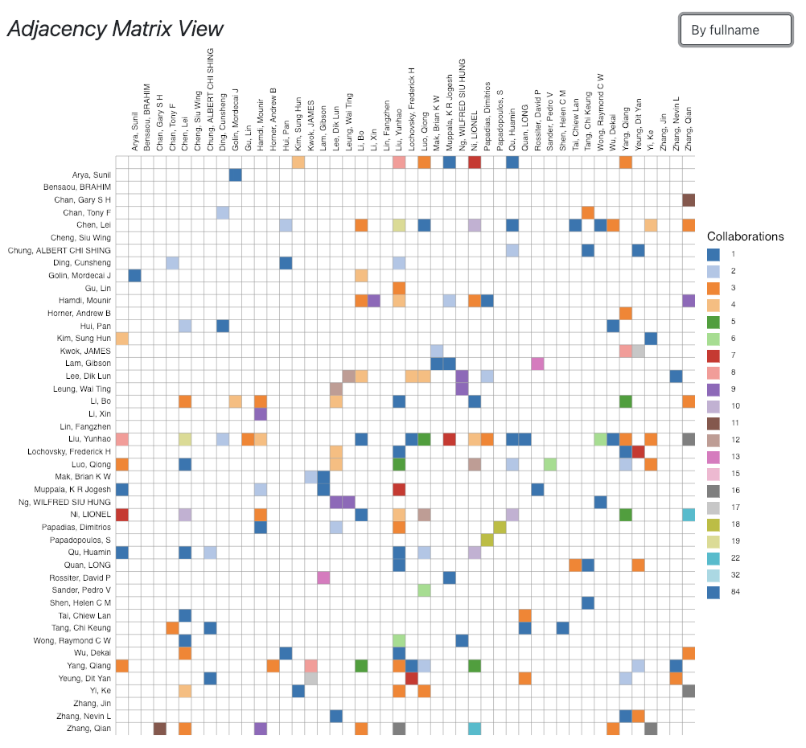
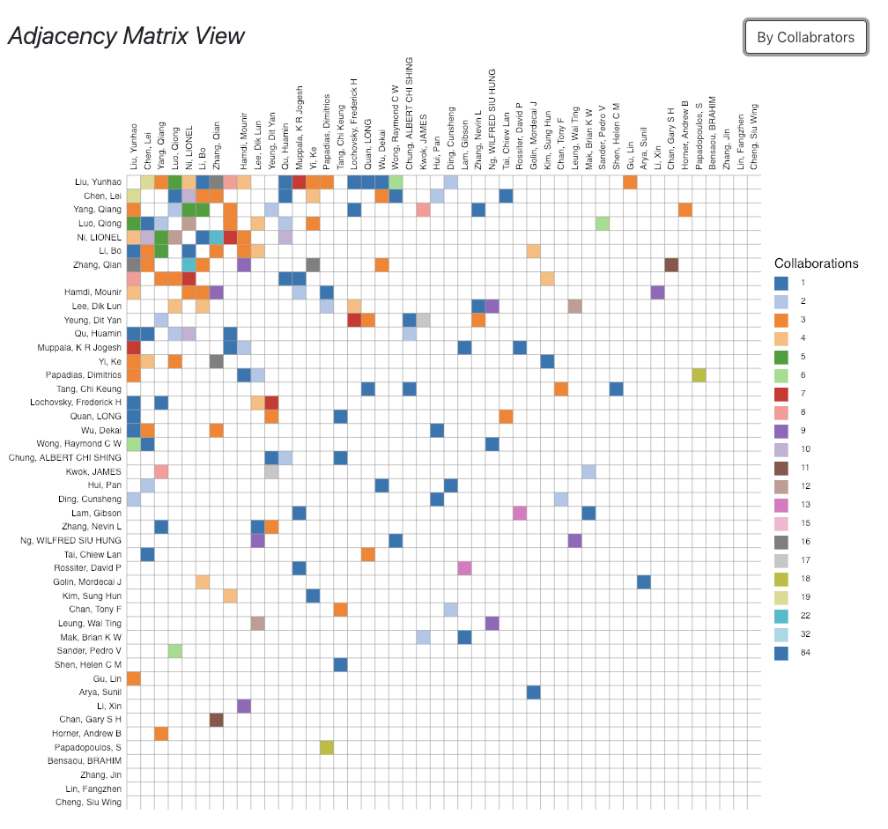

# Challenge3

Implement a node-link diagram and adjacency matrix view to show the collabrations of all professors from Department CSE in HKUST

Import d3.js to draw two related diagrams with the interacted hover effectiveness

## Main page with a node-link diagram and a adjacency Matrix view

## Show the hover effect with two diagrams

## Sorting by ID of professors from Department CSE

## Sorting by fullname of professors from Department CSE

## Sorting by collabrators of professors from Department CSE

## Contact Me
If you've encounted any problems, please do not hesitate to send an email to [Chloe Dong (me)](https://github.com/yifeidongchloe) at yifei2959@gmail.com or opening an issue on github.

