# Challenge4
Analysis the dataset from [Spotify's Worldwide Daily Song Ranking](https://www.kaggle.com/edumucelli/spotifys-worldwide-daily-song-ranking).

Import Pandas library and [plotly library](https://plot.ly/python/getting-started/) to anlalysis data and use Jupyter Notebook to conduct data processing and data visualization

## 1.List the top 10 tracks in the global throughout year 2017 with their total stream counts.

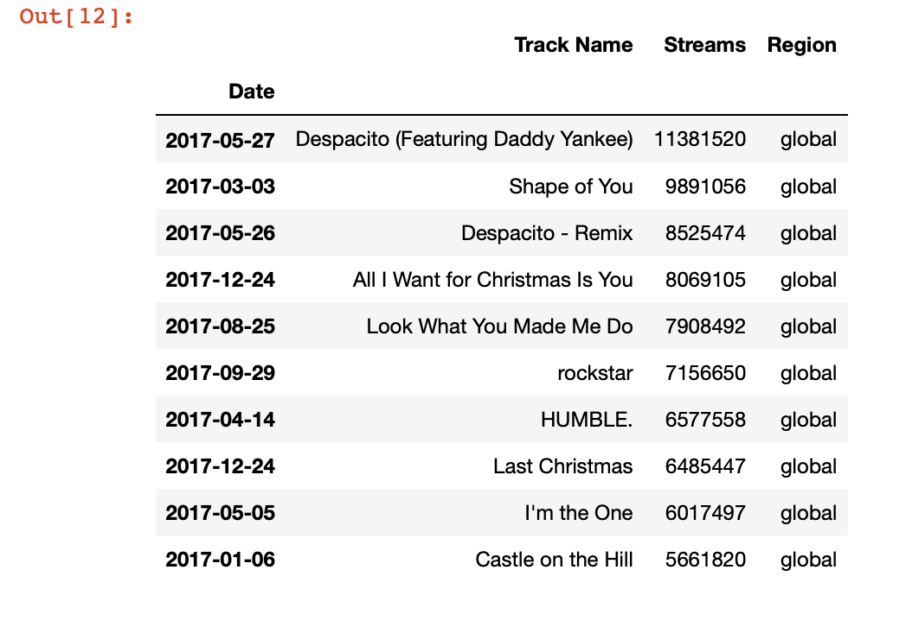

## 2.List the top 10 artists (or groups) those has the most stream counts for all their tracks combined, with the stream counts of each of their tracks.

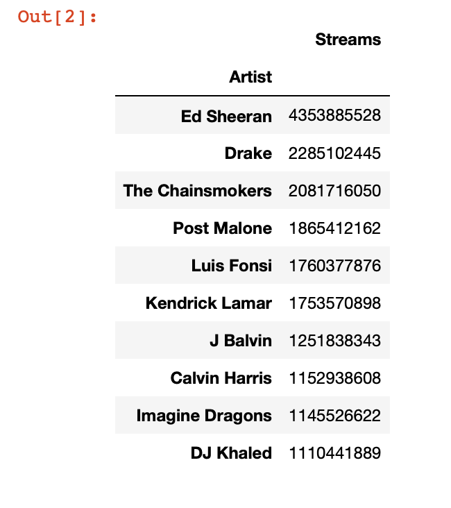

## 3.List the top 10 tracks in December, 2017 for each continent (North America, Europe, Asia, South America, Oceania).

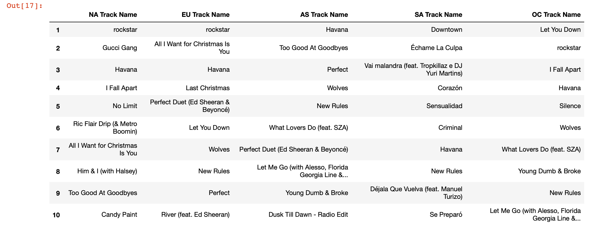

## 4.Plot the ranking changes of the Ed Sheeran's "Shape of You" alongside with the stream count changes.

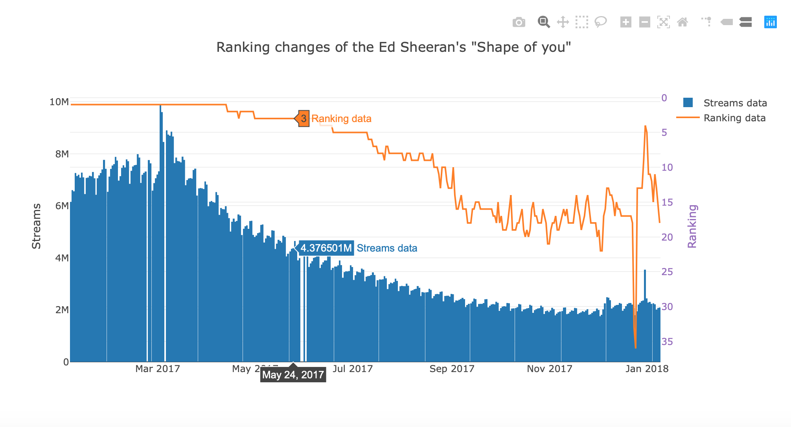

# Bonus:

## Through the above analysis, I list the tendency of top10 tracks' stream in global

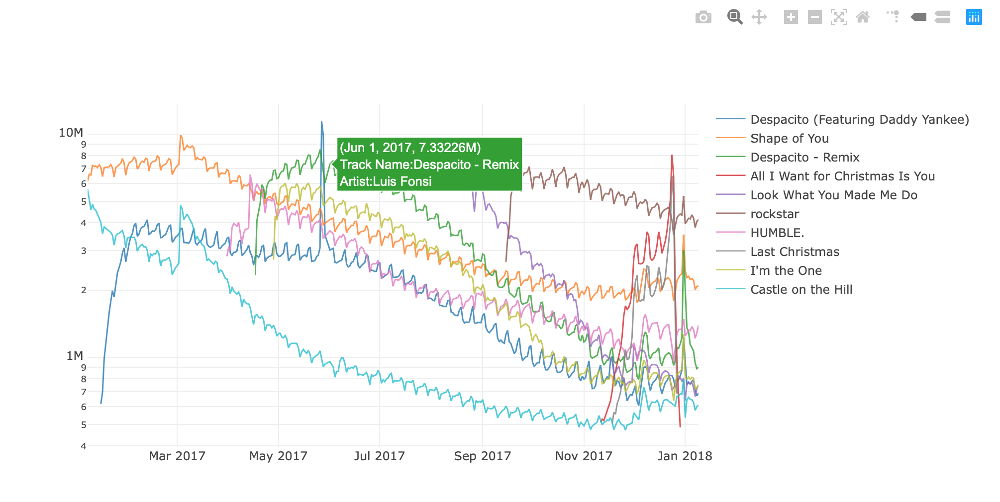

Through the above line chart, we found the top three tracks has a high stream throughout a year. So why the tracks will be rank the top of three?

## Next we will analysis them in three different aspects.
### 1.List the artist of top ten tracks and show how many tracks in the top ten.

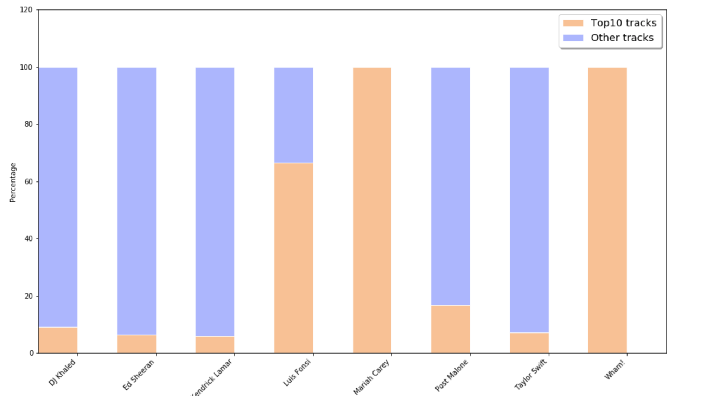

### 2.List the tendency of all of tracks' stream from top three tracks' artists.

Top01 and top03 track's artist---Luis Fonsi
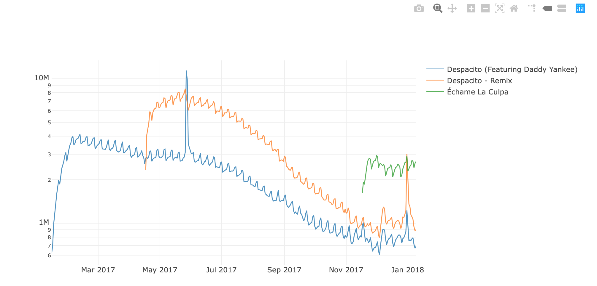
Top02 track's artist---Ed Sheeran
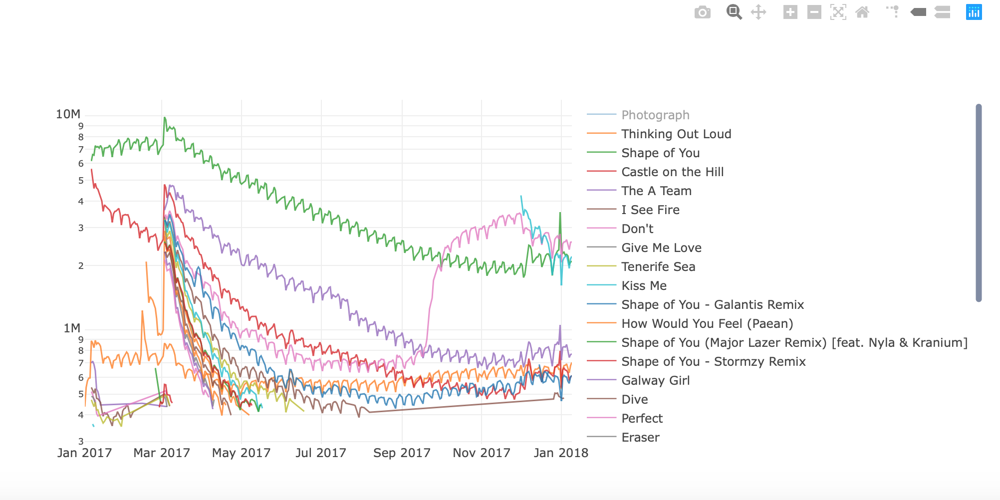
Top04 track's artist---Mariah Carey
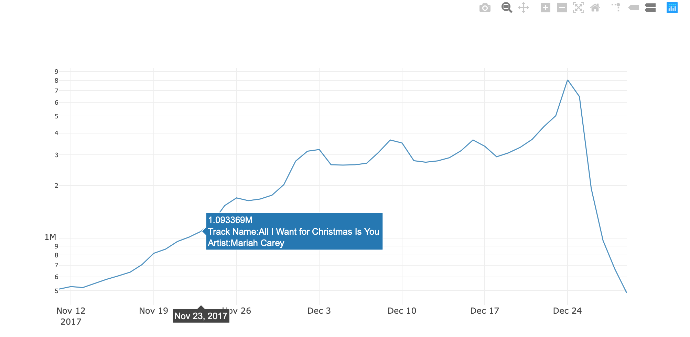

### 3.List the top3 tracks' streams in different continent.

Draw a pie to show the tracks distribution in five continents
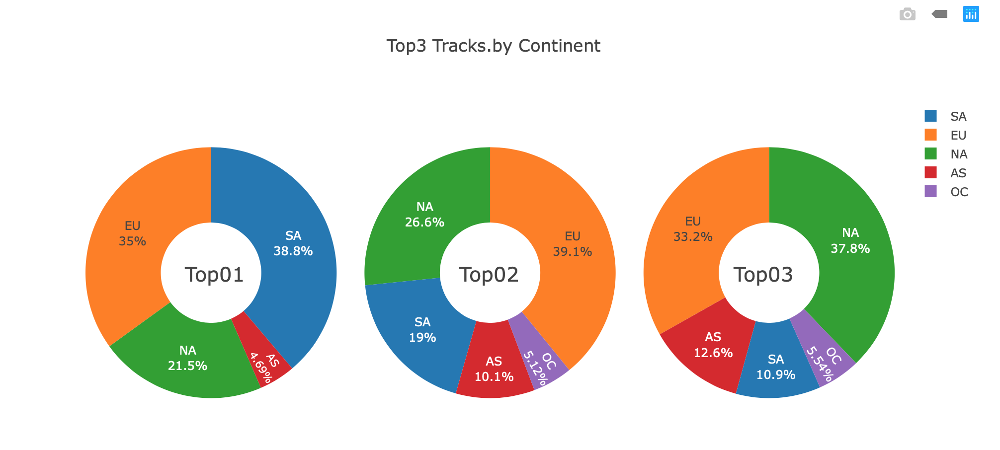
Utilize different method to show the data visualisition
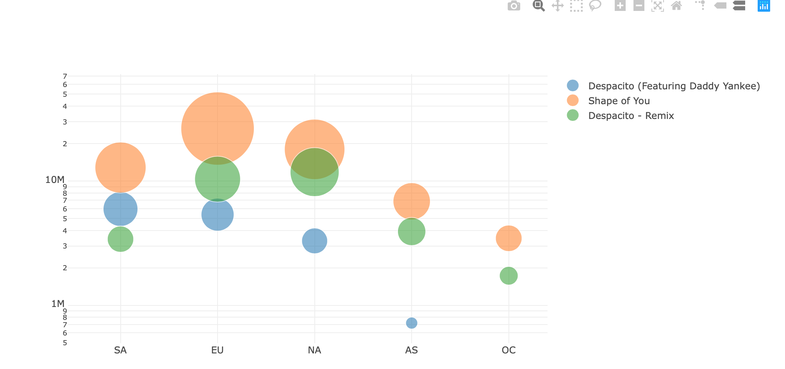

## Through the above analysis, We found that not enought to prove their correlation due to the limitation of data volume. So I 

