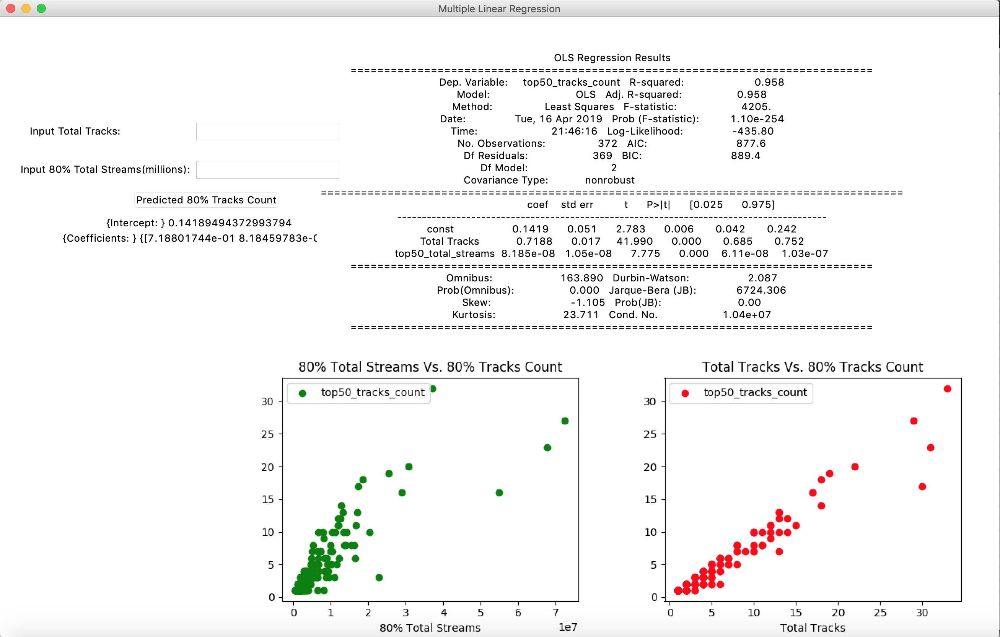
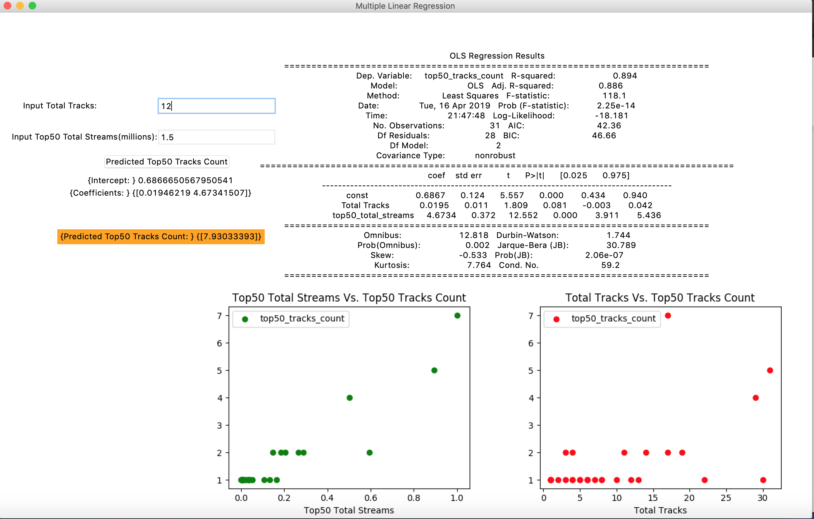
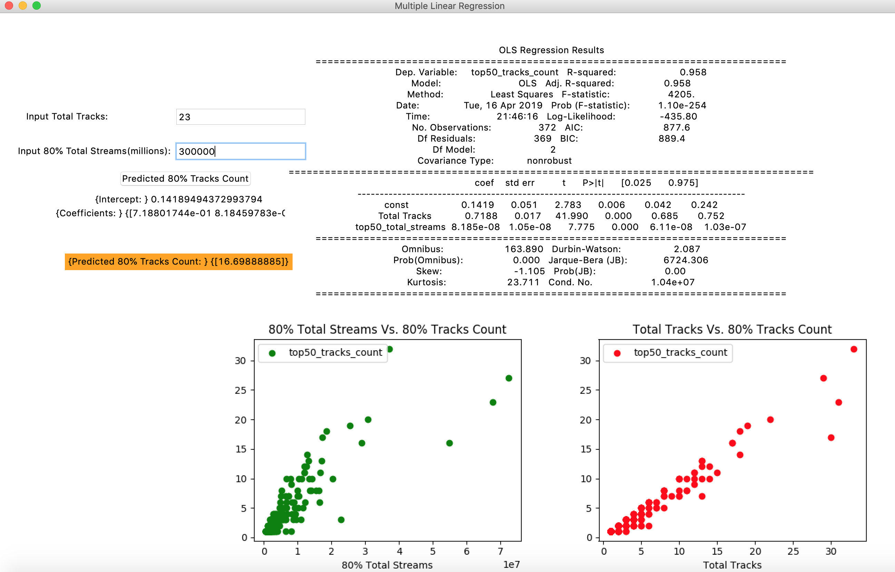

# Challenge4
Analyze the dataset from [Spotify's Worldwide Daily Song Ranking](https://www.kaggle.com/edumucelli/spotifys-worldwide-daily-song-ranking).

Import Pandas library and [plotly library](https://plot.ly/python/getting-started/) to analyze data and use Jupyter Notebook to conduct data processing and data visualization

## 1.List the top 10 tracks in the global throughout year 2017 with their total stream counts.

## 2.List the top 10 artists (or groups) those has the most stream counts for all their tracks combined, with the stream counts of each of their tracks.

## 3.List the top 10 tracks in December, 2017 for each continent (North America, Europe, Asia, South America, Oceania).

## 4.Plot the ranking changes of the Ed Sheeran's "Shape of You" alongside with the stream count changes.

# Bonus:

## Through the above analysis, I list the tendency of top10 tracks' stream in global field

Through the above line chart, we found the top three tracks has a high stream count throughout a year. So why the tracks will be rank the top of three?

## Next we will analysis them in three different aspects.
### 1.List the artist of top ten tracks and show how many tracks in the top ten.

### 2.List the tendency of all of tracks' stream from top three tracks' artists.

Top01 and top03 track's artist---Luis Fonsi

Top02 track's artist---Ed Sheeran

Top04 track's artist---Mariah Carey

### 3.List the top3 tracks' streams in different continent.

Draw a pie to show the tracks distribution in five continents

Utilize different method to show the data visualisition

### Through the above analysis, We found those bonus tasks not enough to be content to prove their correlation relationship. So I decided to conduct a prediction model by using multiple linear regression method for thier number of tracks in top50 or 80% of total volumes.

We set up Y = Top50 Tracks count / 80% Tracks Count, X1 = Total Tracks, X2 = Total Streams of Tracks in top50 / 80%

#### Result in 80% of total volumes

#### Prediction in top50

#### Prediction in 80% of total volumes

## Contact Me
If you've encounted any problems, please do not hesitate to send an email to [Chloe Dong (me)](https://github.com/yifeidongchloe) at yifei2959@gmail.com or opening an issue on github.

