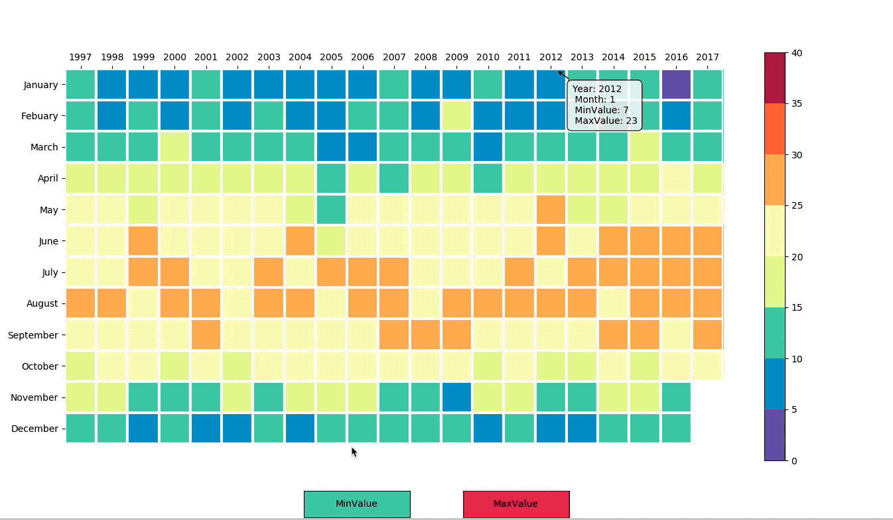
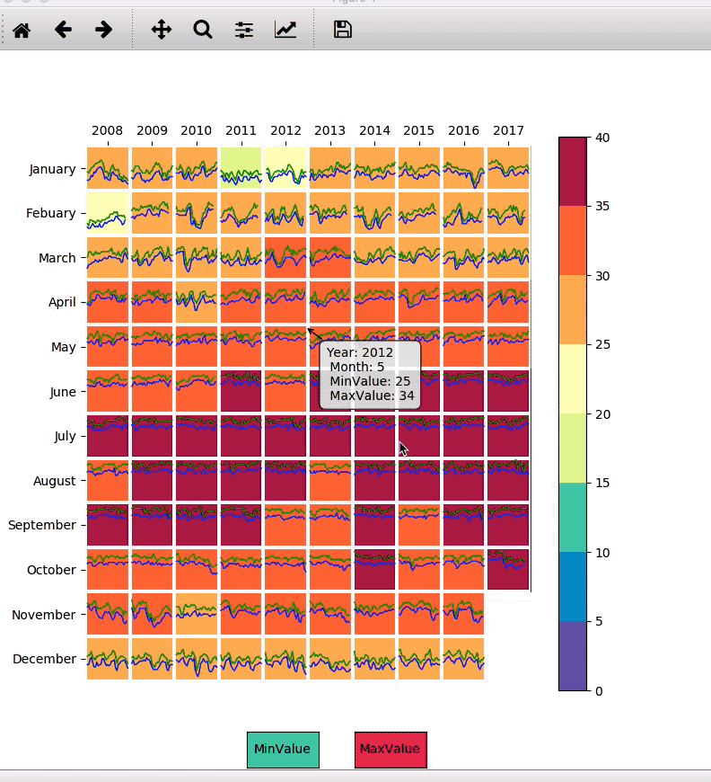

# HKUST Coding Test
Completed the code challenge tasks with Challenge1, 2, 3 and 4.

## View the final results of all challenges from 1 - 4

## Challenge1: [Link](./Challenge1/README.md)

HK Temperature Heatmap by Year and Month

To show the minimum and maximum temperature values among each month from 1997-2017

## Challenge2: [Link](./Challenge2/README.md)

HK Temperature Heatmap by Year and Month and line charts of showing the tendency of daily temperature in each month

To show the daily temperature among each month from 2008-2017

## Challenge3: [Link](./Challenge3/README.md)

Implement a node-link diagram and adjacency matrix view to show the collabrations of all professors from Department CSE in HKUST

## Challenge4: [Link](./Challenge4/README.md)

Completed the requirements and bunus tasks with Spotify's Worldwide Daily Song Ranking dataset

## Contact Me
If you've encounted any problems, please do not hesitate to send an email to [Chloe Dong (me)](https://github.com/yifeidongchloe) at yifei2959@gmail.com or opening an issue on github.
